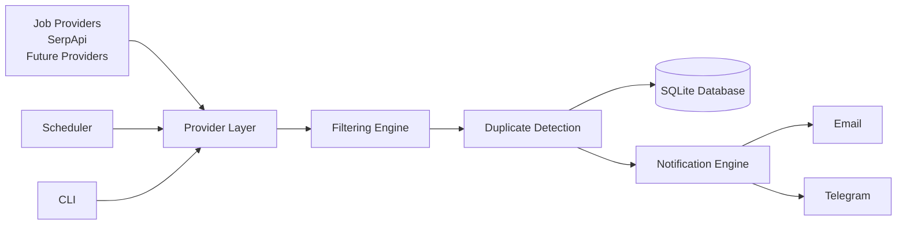
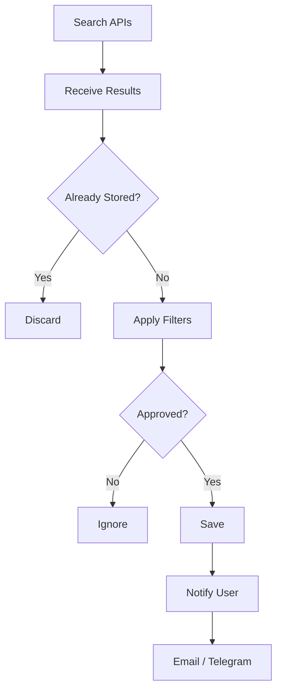

# 🔎 Python Job Search Automation

<div align="center">

**A Python-based platform for monitoring, filtering and organizing job opportunities from multiple providers using APIs, configurable rules and automated notifications.**

<p>


</p>

---

*A practical software engineering project focused on automation, data processing and API integration.*

</div>

---

# 📖 Overview

Python Job Search Automation is an open-source project designed to automate the discovery, filtering and organization of job opportunities using public APIs and configurable processing rules.

Instead of manually checking multiple job platforms several times a day, the application creates an automated pipeline capable of:

- Searching job opportunities
- Applying intelligent filters
- Eliminating duplicates
- Persisting results
- Sending notifications
- Maintaining historical records

The project intentionally avoids direct scraping of employment platforms and is designed around API-based integrations whenever possible.

---

# 🎯 Objectives

The main goals of this project are:

- Automate job opportunity monitoring
- Reduce manual searching effort
- Receive notifications earlier
- Apply highly customizable filtering rules
- Organize opportunities locally
- Build a modular and extensible Python application
- Demonstrate software engineering best practices

---

# 🏗 High-Level Architecture



---

# 🔄 Processing Pipeline



---

# ✨ Planned Features

## 🔍 Job Discovery

- API-based searches
- Multiple providers
- Configurable keywords
- Remote / Hybrid / On-site filtering

---

## 🎯 Advanced Filtering

- Regex support
- Include keywords
- Exclude keywords
- Company allowlist
- Company denylist
- Technology filters
- Seniority filters
- Geographic filters

---

## 💾 Data Storage

- SQLite database
- Duplicate detection
- Search history
- Opportunity status

---

## 🔔 Notifications

- Email
- Telegram
- Future providers

---

## ⚙ Automation

- Manual execution
- Scheduled execution
- Configurable frequency

---

# 🧰 Technology Stack

| Technology | Purpose |
|------------|---------|
| Python | Core application |
| SerpApi | Job provider |
| SQLite | Local database |
| JSON | Configuration |
| Regex | Filtering |
| Requests | HTTP client |
| Logging | Application logging |

---

# 📁 Planned Project Structure

```
python-job-search-automation/
│
├── config/
│ ├── filters.example.json
│ ├── config.json
│
├── src/
│ ├── providers/
│ ├── filters/
│ ├── notifications/
│ ├── storage/
│ ├── scheduler/
│ ├── utils/
│ └── main.py
│
├── database/
│
├── tests/
│
├── docs/
│
├── README.md
├── ROADMAP.md
├── requirements.txt
└── LICENSE
```

---

# 🚀 Current Development Stage

The project is currently under active development.

Initial milestones include:

- Repository structure
- Configuration system
- SerpApi integration
- SQLite persistence
- Filtering engine
- Notification system

Future milestones are documented in **ROADMAP.md**.

---

# 🛡 Responsible Use

This project **does not perform direct scraping** of LinkedIn or other employment platforms.

The application is designed to retrieve job opportunities through supported APIs and publicly available providers.

The project does not attempt to:

- bypass authentication
- circumvent CAPTCHA
- access private data
- automate job applications
- violate platform security mechanisms

Users are responsible for complying with the Terms of Service and usage policies of each configured provider.

---

# 📈 Future Roadmap

Planned future improvements include:

- Multiple providers
- FastAPI REST API
- PostgreSQL support
- Docker deployment
- GitHub Actions
- Unit testing
- Prometheus metrics
- Grafana dashboards
- Job ranking engine
- Web dashboard

For more details, see:

**📄 ROADMAP.md**

---

# 🤝 Contributing

Contributions, ideas and suggestions are welcome.

Feel free to:

- Open an Issue
- Submit a Pull Request
- Suggest improvements
- Report bugs

---

# 📄 License

Distributed under the MIT License.

---

# 👨‍💻 Author

**Itamar de Sá Britto Júnior**

GitHub:

https://github.com/itamarsb

---

## 📈 Repository Metrics

<p align="center">

<a href="https://info.flagcounter.com/X7d4"></a>

</p>
