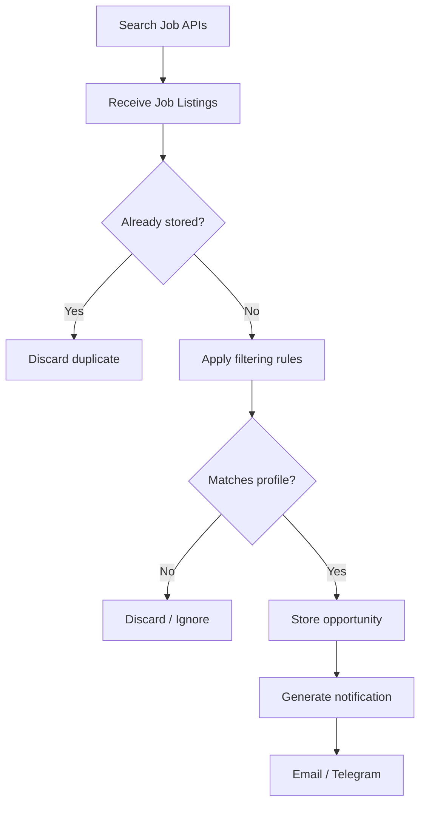

# 🔎 Python Job Search Automation

> A Python-based platform for monitoring, filtering and organizing job
> opportunities from multiple providers using APIs, configurable rules
> and automated notifications.

[badges]

---

## 📌 Overview

Python Job Search Automation is an open-source project designed to automate
the discovery and organization of job opportunities without directly scraping
job platforms.

The application retrieves job listings through supported APIs, processes the
results using configurable filtering rules, stores relevant opportunities
locally, eliminates duplicates and sends notifications when matching positions
are discovered.

The project was created to solve a practical problem: job alerts from traditional
platforms may arrive late, contain duplicates or include positions that do not
match the candidate's actual profile.

Instead of repeatedly searching multiple platforms manually, the application
creates a configurable job monitoring pipeline.

---

## 🎯 Project Goals

- Automate job opportunity discovery
- Query job listings through supported APIs
- Avoid direct scraping of employment platforms
- Apply customizable inclusion and exclusion filters
- Detect and eliminate duplicated opportunities
- Store historical job data
- Send automated notifications
- Allow scheduled and manual execution
- Provide an extensible architecture for additional providers

---

## 🏗️ Architecture

---

## 🛡️ Responsible Use & Data Sources

This project is designed to retrieve job information through supported APIs
and publicly available data providers.

It does not implement direct scraping, authentication bypass, CAPTCHA
circumvention, or automated interaction with protected areas of employment
platforms.

The application is intended for personal job opportunity monitoring,
data organization and software engineering experimentation.

Users are responsible for reviewing and complying with the terms of service,
rate limits and usage policies of each configured data provider.

---

## 📈 Repository Metrics

